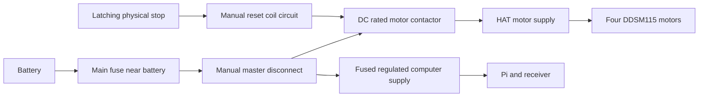

# Independent motor-power stop design

This is the wiring design to build and verify; it is not a report that the cutoff has been installed. The software STOP, watchdog, and confirmed stationary feedback remain separate from hardware removal of motor power.

## Power topology

The supplied Waveshare HAT (A) schematic connects its DC/XT60 input and all four motor-power connectors to the same `24V` net. Its onboard logic/power conversion can therefore lose power when that input is interrupted. Do not assume opening the HAT input preserves the Pi or ESP32. Verify the actual board revision with the schematic and continuity measurements while unpowered.

Use a normally open DC contactor whose coil must remain energized to provide motor power. A latching stop button opens the normally closed coil control circuit; a broken control wire or lost coil supply must also drop the contactor. A separate manual reset/seal-in circuit prevents release of the button or restoration of power from automatically restoring motor power. The Pi and ESP32 cannot reset or bypass this circuit. Keep a manual battery disconnect accessible.

Split the computer supply before the motor contactor, with its own fuse and regulated output rated for the measured Pi/receiver load. Confirm whether the HAT logic can remain powered independently without backfeeding its onboard regulator or the Pi header. If the board cannot support this safely as supplied, preserve only Pi/receiver power and report HAT communication missing. Do not cut traces or connect competing 5 V sources based on this document. Keeping the ESP32 alive is optional; actually removing all motor power is required.

## Component selection and review

Select the fuse, cable, connector, contactor interrupt rating, coil suppression, and enclosure for the measured battery voltage, maximum charging voltage, fault current, motor startup/regeneration behavior, and wiring ampacity. Torque current telemetry does not establish battery current. Record the exact component part numbers, measured topology, and any regeneration/transient suppression needed in the trial record. No electrical ratings can be certified from the available software files.

Review the completed circuit with a person qualified to verify its DC power design before energizing it. Disconnect battery and USB before continuity testing. Confirm the motor branch is actually isolated: no alternate supply, USB path, or signal connection may keep the motors powered. The cutoff must be usable locally if the radio, Pi, ESP32, or both software loops fail.

## Acceptance measurements

With wheels raised and the robot restrained, measure motor-branch voltage and power removal time for the physical stop, broken coil wire, lost coil supply, and manual battery disconnect. Repeat with the Pi process deliberately stalled and with the HAT watchdog reset test. Releasing the stop must leave motor power disabled until manual reset; manual reset must not authorize driving. The software must establish a new inhibited session after a HAT reset and require neutral plus a fresh arm cycle.

Record whether computer power survives, whether stop feedback remains available, and whether motor supply decay or regeneration keeps torque available after opening. Record reset-to-stop time independently from the software watchdog timeout. Never infer chassis rest from a serial acknowledgment.

Motor-power removal eliminates powered holding. A robot that must remain parked on a slope during power loss needs a separately qualified mechanical brake or retention method.

Reference: the supplied HAT schematic, kept outside the repository at `Robot Code/reference/tmp-pdfs/hat_schematic.pdf` on the project Mac (retain an official schematic copy with the hardware record), [Waveshare HAT documentation](https://www.waveshare.com/wiki/DDSM_Driver_HAT_%28A%29), [DDSM115 feedback definitions](https://www.waveshare.com/wiki/DDSM115), and [Espressif watchdog reset behavior](https://docs.espressif.com/projects/esp-idf/en/v5.5/esp32/api-reference/system/wdts.html).
