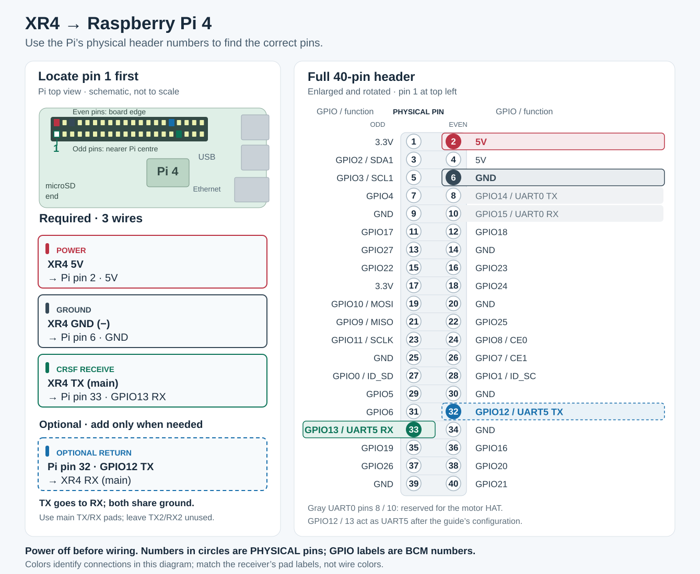

# Robot software, firmware, and controller setup

This guide covers the remaining setup for your **Raspberry Pi 4**, **Waveshare DDSM Driver HAT (A)**, **RadioMaster Pocket with built-in 2.4 GHz ExpressLRS**, and **XR4 receiver**. This guide includes the XR4-to-Pi wiring. Motor wiring and wheel-ID assignment are prerequisites. The drive program expects **four unique wheel IDs**: 1 front left, 2 front right, 3 rear right, 4 rear left.

Two different devices receive software:

| Device | What goes on it | How |
| --- | --- | --- |
| Raspberry Pi | Python drive program and config | Copy files over the network, then install one Python dependency |
| HAT's ESP32 | The custom **robot_hat.ino** firmware | Upload with Arduino IDE through the HAT's **ESP32-USB** port |
| Pocket and XR4 | Their existing EdgeTX/ExpressLRS software | Create a model, set channels, choose an ELRS mode, and bind |

This is the protocol v2 commissioning build. Software verification is recorded in **IMPLEMENTATION_STATUS.md**. It has **not** been qualified on the assembled four-wheel robot yet. Keep all four wheels raised and a physical power cutoff within reach for the first powered checks.

## 1. Find the files on the Mac

In Finder, press **Command+Shift+G**, paste this path, then press Return:

~~~text
/Users/ambesnoff/Desktop/Capstone/Robot Code/Capstone-Bombsquad-Robot
~~~

This is a Git checkout of **main**. Bring it up to date in a Mac Terminal before you copy files to the Pi or flash the HAT:

~~~sh
cd "$HOME/Desktop/Capstone/Robot Code/Capstone-Bombsquad-Robot"
git checkout main
git pull
~~~

The Pi files are in that folder. The HAT sketch is **hat_firmware/robot_hat/robot_hat.ino**. Do not copy or flash from the older ChatGPT project folder under `~/.codex`; it still holds the code from before the audit fixes.

You will need a microSD card and reader, the Mac and Pi on the same network, a USB-C **data** cable for the HAT, Arduino IDE 2, the Pocket's supplied antenna and 18650 cells, and both XR4 antennas.

## 2. Put Raspberry Pi OS on the microSD card

Skip this section if your Pi already boots Raspberry Pi OS and you can SSH into it.

1. Install [Raspberry Pi Imager](https://www.raspberrypi.com/software/) on the Mac. Use it to write **Raspberry Pi OS Lite (64-bit)** to the microSD card.
2. In Imager's customization screens, set **hostname: robotpi**, **username: robot**, and a password you keep. Enter Wi-Fi details if needed. Enable **SSH with password authentication**. The commands below use these example names; substitute your actual names if you already use others.
3. Put the card in the Pi and boot it. For Pi-only setup, you can power the Pi through USB-C while the HAT is removed. Later, when the HAT is seated, use the power arrangement you have verified for your robot.
4. Open **Terminal on the Mac**:

~~~sh
ssh robot@robotpi.local
~~~

Accept the first connection prompt and enter the Pi password. If the hostname does not resolve, look up the Pi's IP address in your router and use **ssh robot@IP_ADDRESS**. [Raspberry Pi's first-boot and SSH guide](https://www.raspberrypi.com/documentation/computers/getting-started.html).

## 3. Set up the Pi's two serial ports

The HAT communicates with the Pi through the header UART. The XR4's CRSF output uses a second Pi UART. On the **Pi's SSH terminal**, run:

~~~sh
sudo raspi-config
~~~

Select **Interface Options → Serial Port**. Answer **No** to a login shell on serial, then **Yes** to enabling serial hardware. Exit. Now run:

~~~sh
sudo systemctl disable hciuart
sudo nano /boot/firmware/config.txt
~~~

At the end of the file, under an existing **[all]** section or after adding one, add:

~~~text
dtoverlay=disable-bt
dtoverlay=uart5
~~~

Save with **Control+O**, Enter, **Control+X**. Do not add a CTS/RTS option to uart5. The **disable-bt** choice gives the HAT's header link the stable PL011 UART and disables Pi Bluetooth. Reboot, then reconnect:

~~~sh
sudo reboot
~~~

~~~sh
ssh robot@robotpi.local
readlink -f /dev/serial0
ls -l /dev/ttyAMA5
~~~

The first check should show **/dev/ttyAMA0**; the second should find **/dev/ttyAMA5**. If your OS has **/boot/config.txt** instead, edit that file. [Official Raspberry Pi UART instructions](https://www.raspberrypi.com/documentation/computers/configuration.html#configure-uarts).

### 3a. Connect the XR4 wires to the Pi

Shut the Pi down with `sudo poweroff`, wait for shutdown, then disconnect all robot power before attaching wires. The XR4 connects through its **main CRSF serial pads** labeled **TX**, **RX**, **5V**, and **− / GND**. Its **TX2/RX2** pads are a second UART and are not used here. The two tiny antenna sockets connect only to the supplied antennas.

There is no single XR4 plug that fits the Pi's header: connect each lead to its own pin in the table below. Use the labels on the receiver, not the wire colors or the order of loose connectors. If the supplied lead ends are bare, solder them to the matching receiver pads and use insulated female jumper ends or a suitable breakout at the Pi; bare wire must not touch adjacent header pins.

| XR4 pad / lead | Connect to the Pi's 40-pin header | Purpose |
| --- | --- | --- |
| **5V** | **Physical pin 2 — 5 V** | Receiver power from the robot's existing regulated 5 V rail |
| **− / GND** | **Physical pin 6 — ground** | Common ground |
| **TX** (main CRSF output) | **Physical pin 33 — GPIO13 / UART5 RX** | Required: sends the radio channels to the Pi |
| **RX** (main CRSF input) | **Physical pin 32 — GPIO12 / UART5 TX** | Optional: sends robot telemetry back to the receiver; leave disconnected for the first radio check |

**TX connects to RX, and RX connects to TX.** The table uses **physical pin numbers** to locate the connector: **pin 33 is GPIO13**, not GPIO33. UART5 is the `dtoverlay=uart5` port enabled above and matches `radio_port: /dev/ttyAMA5` and `radio_baud: 420000` in `config.json`. Do not enable UART5 CTS/RTS; those signals would occupy the HAT's GPIO14/15 pins.

*Top view of the Pi 4, with USB/Ethernet sockets at the right and the 40-pin GPIO header along the top edge. Pin 1 is at the left end, in the row nearer the board center; pin 2 is directly above it. Count across each row by twos. The diagram marks the physical pins and their GPIO names separately.*

The DDSM Driver HAT (A) occupies the Pi's header. Reach these **same physical pins** using a correctly aligned stack-through header or GPIO breakout that preserves the HAT connections. If the HAT hides the pins, do not guess from the HAT's other connectors. **Pi pins 8 and 10 (GPIO14/15) are reserved for the HAT's serial link**; the XR4 belongs on pins 33/32.

Power the XR4 from **one** regulated 5 V source. Pin 2 is a connection to the Pi's existing 5 V rail, not a separate power input to add to an already powered system. Do not connect the robot battery directly to the receiver, use the 3.3 V pins for receiver power, or join independent 5 V supplies. If using a separate receiver regulator, leave XR4 5V off Pi pin 2 and join its ground to Pi pin 6.

The Pi's GPIO signal pins use **3.3 V logic and are not 5 V tolerant**. The receiver's 5 V supply does not make its serial signals 5 V. Verify the XR4 signal levels before direct connection; use appropriate level translation if they exceed 3.3 V.

These connections follow the [RadioMaster XR4 pad diagram](https://cdn.shopify.com/s/files/1/0609/8324/7079/files/XR4.pdf?v=1739432399), [Raspberry Pi GPIO documentation](https://www.raspberrypi.com/documentation/computers/raspberry-pi.html#gpio), and [official UART5 overlay definition](https://github.com/raspberrypi/linux/blob/rpi-6.12.y/arch/arm/boot/dts/overlays/README). The [RadioMaster product page](https://www.radiomasterrc.com/products/xr4-gemini-xrossband-dual-band-expresslrs-receiver) and manual give different input-voltage ranges; **5 V** is within both. The [Waveshare HAT schematic](https://files.waveshare.com/wiki/DDSM-Driver-HAT-%28A%29/DDSM_Driver_HAT_%28A%29_Sch.pdf) confirms the HAT's serial pins and available GPIO12/13.

## 4. Copy the drive program to the Pi

Use a **Mac Terminal** window for this block. It copies runtime modules, factory motor-ID tools, the example config, and deployment files:

~~~sh
ROBOT_PROJECT="$HOME/Desktop/Capstone/Robot Code/Capstone-Bombsquad-Robot"
ssh robot@robotpi.local 'mkdir -p ~/robot'
scp "$ROBOT_PROJECT"/*.py "$ROBOT_PROJECT"/robot_protocol.json "$ROBOT_PROJECT"/requirements.txt "$ROBOT_PROJECT"/config.example.json robot@robotpi.local:~/robot/
scp -r "$ROBOT_PROJECT"/deploy robot@robotpi.local:~/robot/
~~~

In the **Pi's SSH terminal**, install the dependency in a Python virtual environment:

~~~sh
sudo apt update
sudo apt install -y python3-venv curl
sudo usermod -aG dialout "$USER"
~~~

Raspberry Pi OS does not include Python 3.14. If `python3.14 --version` does not print **3.14.8**, install it with [uv](https://docs.astral.sh/uv/). It installs into your home folder and leaves the system Python alone:

~~~sh
curl -LsSf https://astral.sh/uv/install.sh | sh
~/.local/bin/uv python install 3.14.8
~~~

Log out with **exit** and SSH back in so the serial-port permission and `python3.14` take effect. Then:

~~~sh
cd ~/robot
python3.14 -m venv .venv
./.venv/bin/python --version
./.venv/bin/python -m pip install -r requirements.txt
cp config.example.json config.json
./.venv/bin/python robot_main.py check --config config.json
~~~

The robot requires Python **3.14.8**; `--version` must print it, so create the virtual environment with `python3.14`. The last line of the check should report **fast** mode, wheel IDs **1–4**, motor port **/dev/serial0**, and radio port **/dev/ttyAMA5**. This is a config check only; it does not communicate with hardware. The virtual environment avoids current Raspberry Pi OS restrictions on system-wide pip installs. [Pi OS Python guidance](https://www.raspberrypi.com/documentation/computers/os.html).

## 5. Configure the Pocket controller

Fit the Pocket's top antenna before turning on its RF module. Install its two 18650 cells with the polarity shown by the radio. Create a new EdgeTX model named **Robot**. In **Model Setup**, choose **Internal RF = CRSF** and **External RF = Off**. The Pocket's internal ELRS is **2.4 GHz**; it can use the XR4 in standard 2.4 GHz mode. The XR4's dual-band Gem-X mode needs a compatible external transmitter module and is not required here. [Pocket manual](https://cdn.shopify.com/s/files/1/0701/8066/7584/files/Pocket_A1.8.pdf?v=1770617495), [ExpressLRS transmitter setup](https://www.expresslrs.org/quick-start/transmitters/tx-prep/).

On the EdgeTX **Mixes** page, set one direct mix for each channel. Start with **100% weight, zero offset, no added curve, and no delay**. Remove any default mix that would conflict. This is the mapping in **config.json**:

| Channel | Pocket control example | Meaning to robot |
| --- | --- | --- |
| CH1 | Right stick horizontal / Aileron | Steering, centered at 0 |
| CH3 | Throttle stick | Fully low is stop (−100%); up requests speed |
| CH5 | SA latching switch | Low = disarmed; low then high at neutral = arm |
| CH6 | **SB three-position switch** | Low Gentle; center Normal; high Boost |
| CH7 | SD latching switch | High = stop |
| CH8 | SC position switch | Low/center forward; high reverse |

**SB is the confirmed physical mode switch. CH6 is the example mix, not a channel inherent to SB.** In EdgeTX **Mixes**, select the CH6 row and set its source to SB. Check **Channel Monitor**: moving only SB must move only CH6 through about -100%, 0%, +100%. If your existing model uses another channel, change `channels.profile` in `config.json` to that channel and keep all control mappings distinct. The S1 current dial is no longer used in fast mode. The [EdgeTX Mixes guide](https://manual.edgetx.org/bw-radios/model-select/inputs-mixes-and-outputs/mixes) describes channel sources.

Configure an ELRS switch mode that preserves all three SB positions on the chosen channel. With **SB on CH6 and arm on CH5**, use **333 Hz Full / 12ch Mixed** if supported; set the Pocket internal serial baud to the documented rate (921k for 333 Hz) and restart. **250 Hz / Wide** is a usable fallback for CH6; verify actual received positions. ELRS Hybrid/Wide always transmits CH5 as two positions, and ELRS 3.x Full 8ch/12ch Mixed also reserves CH5 for two-position arming. If you later assign the three-position mode to CH5, select **Full 16ch Rate/2** and verify its low/center/high values; ELRS 4.x changes Full Resolution channel behavior. Keep the physical arm on a distinct channel and configure ELRS's own arming method appropriately. Change switch mode while the receiver is off. [ExpressLRS switch modes](https://www.expresslrs.org/software/switch-config/) and [baud recommendations](https://www.expresslrs.org/quick-start/transmitters/tx-prep/#serial-baud-rate).

## 6. Attach and place the antennas; bind the XR4

The XR4 uses **both** supplied T antennas. Align each tiny IPEX-1/U.FL plug with a receiver socket and press straight down until it clicks. Do not pull on the thin cable. Secure the coax so vibration cannot pull the plugs loose. Place the active T ends in open air away from metal, the battery, and motor wiring. Separating them and using different orientations, roughly 90° if practical, is a useful diversity layout; RadioMaster specifies no exact spacing or angle. Keep the Pocket's own antenna attached whenever its RF module is on. [XR4 manual](https://cdn.shopify.com/s/files/1/0609/8324/7079/files/XR4.pdf?v=1739432399), [Pocket manual](https://cdn.shopify.com/s/files/1/0701/8066/7584/files/Pocket_A1.8.pdf?v=1770617495), [U.FL connector handling](https://www.hirose.com/product/download/?distributor=all&lang=en&series=U.FL&type=catalogue).

You do **not** need an independent XR4 power switch. The XR4 has a small **BIND** button on its top face, near the left antenna socket. With the robot safely raised, the arm switch low, and the stop switch high, power the XR4 through the robot's normal power arrangement. Do **not** rapidly power-cycle the entire Pi/robot to bind. Regulated **5 V** is within both of RadioMaster's conflicting published XR4 voltage ranges. [XR4 product page](https://www.radiomasterrc.com/products/xr4-gemini-xrossband-dual-band-expresslrs-receiver), [XR4 manual and button diagram](https://cdn.shopify.com/s/files/1/0609/8324/7079/files/XR4.pdf?v=1739432399).

1. Turn the Pocket **off**. With the XR4 already powered, press and hold its **BIND** button for about **1.5 seconds**; release when its LED shows a quick double-blink. Do not hold the button while first applying power. ExpressLRS 3.4 and newer support this button method; the XR4 manual lists 3.5.1 as preinstalled.
2. Turn on the Pocket. Open **SYS → ExpressLRS → Bind**. A solid XR4 LED means it is bound. [Official ExpressLRS binding guide](https://www.expresslrs.org/quick-start/binding/).
3. If binding fails, check that transmitter and receiver have the same **ExpressLRS major firmware version**, compatible RF region, and Model Match setting. Traditional binding requires **no binding phrase** on the receiver. Check the actual firmware version on your unit before updating anything.

The XR4 retains its normal ExpressLRS firmware. It does not get the robot firmware. Its CRSF serial rate is **420000 baud**, as set in the example Pi config.

## 7. Check the controller in the Pi program

Once you have connected the XR4 to the Pi's UART5 and powered the Pi using your finished hardware arrangement, run:

~~~sh
ssh robot@robotpi.local
cd ~/robot
./.venv/bin/python robot_main.py check --config config.json
./.venv/bin/python robot_main.py monitor-radio --config config.json
~~~

**monitor-radio** reads the receiver without opening the motor port. It should print **healthy=True** and positive **LQ**. Hold each switch long enough to see it in the periodic display. Verify:

- Throttle about **−1** fully low, rising toward **+1** as you raise it.
- Steering about **0** centered, negative left, positive right.
- CH5 arm and CH7 stop each read about **−1** low and **+1** high.
- **SB / CH6** reports distinct low, center, and high raw values. The drive's live view shows Gentle/Normal/Boost selection after debounce when you run it in the restrained setup.
- **SC / CH8** changes reverse. If SB changes another channel, correct the mix or configuration before arming.
- Default profile ranges are raw CRSF 150..350, 850..1150, and 1650..1850; adjust these disjoint ranges only from observed values. Invalid input falls back to Gentle and cannot request Boost.

Press **Control+C** to exit. If the XR4 LED is solid but there are no channels, check the receiver's CRSF output, UART5 device, and **radio_baud: 420000** in config. If channels appear but **healthy=False**, the program also needs fresh positive link-quality statistics; do not bypass that condition.

## 8. Upload the HAT firmware

Do this **after you have assigned the four motor IDs**, since the ID utility uses the original Waveshare HAT firmware. You are handling that step yourself. Shut down the Pi cleanly, turn robot power off, disconnect motor power, and remove the HAT from the Pi for USB upload.

1. Install [Arduino IDE 2](https://www.arduino.cc/en/software) on the Mac.
2. In **Preferences → Additional Boards Manager URLs**, add **https://espressif.github.io/arduino-esp32/package_esp32_index.json**. In **Boards Manager**, install **esp32 by Espressif Systems**, version **3.3.12**, and select **ESP32 Dev Module**. [Espressif Arduino setup](https://docs.espressif.com/projects/arduino-esp32/en/latest/installing.html).
3. In Arduino IDE, open **hat_firmware/robot_hat/robot_hat.ino** from the complete sketch folder (keep all `.h` files alongside it) from the project folder. Connect the HAT's **ESP32-USB** port, not the **DDSM-USB** motor-bus port, to the Mac with a data cable. Select the new serial port. Set the HAT's control switch to **ESP32**.
4. Click **Verify**. If that succeeds, click **Upload** and wait for **Done uploading**. Disconnect the HAT USB cable, reseat the HAT on the Pi, and restore your verified robot power arrangement. [Arduino upload guide](https://docs.arduino.cc/software/ide-v2/tutorials/getting-started-ide-v2/).

The upload replaces Waveshare's HAT firmware, but the wheel IDs are stored in the motors. If you need the original HAT interface back, Waveshare provides a [factory restore package](https://github.com/waveshareteam/ddsm_example#quick-factory-reset) that flashes through ESP32-USB; its included flashing program is a **Windows executable**.

## 9. Test the implemented modes with raised wheels

Connect all four unique IDs, restrain the chassis with wheels raised, and verify the physical motor-power cutoff described in [INDEPENDENT_STOP.md](INDEPENDENT_STOP.md). Start with throttle low, **SB Gentle**, SA arm low, and SD stop high. The program starts motion-inhibited and reports the HAT's independent stop state.

~~~sh
cd ~/robot
./.venv/bin/python robot_main.py run --config config.json --telemetry logs/robot.csv
~~~

1. Require fresh four-wheel feedback and **STOP CONFIRMED**, accepted configuration identity, and the expected protocol/capabilities. Release SD stop, keep throttle low, then move SA low to high.
2. In Gentle, add low throttle. Check each raised wheel's direction and actual/target RPM. Check steering and **SC / CH8** reverse; stop before changing any wheel polarity.
3. At low demand, select SB center and high. The view shows requested/applied profile, actual per-wheel current cap, measured current/temperature/age, warnings, Boost remaining/refill, and holding. The supplied fast configuration permits the full **0.8 / 1.5 / 2.5 A** profiles. There is no 1.2 A cap. Boost allowance, thermal derating, and fault protection can still limit a request; every limitation is visible.
4. Verify neutral settling/holding, individual zero-wheel turns, profile transitions, Boost expiry/refill, SD stop, SA disarm, radio off/reconnect, Pi restart, and HAT restart. Recovery requires neutral and a fresh arm cycle; no restart restores previous motion permission.
5. Ctrl+C requests and verifies stop. If confirmation is missing, use the physical cutoff. Stop-confirmed telemetry does not prove the chassis is mechanically retained on a slope.

Logs have unique session names; configuration metadata and events accompany them. The view shows dropped rows and storage errors. A slow or failed disk does not block the drive loop. The example now sets a **250 RPM** maximum target and **15 ms** control period; these are configured settings, not measured performance. Existing configurations keep their previous maximum until edited. Follow [the 250 rpm update guide](docs/UPDATE_250_RPM.md) for this PR. Candidate 0.8/1.5/2.5 A profiles and 20 s / 60 s Boost allowance require measured acceptance, with separate electrical/thermal acceptance for Normal and Boost. Follow [COMMISSIONING.md](COMMISSIONING.md) before lowering the robot. Battery/BMS/wiring current is not measured by motor torque telemetry.

For optional radio feedback, connect **Pi physical pin 32 / GPIO12 / UART5 TX** to the XR4's main **RX** pad as shown in [the wiring table](#3a-connect-the-xr4-wires-to-the-pi), then enable `radio_telemetry_enabled` in the config. The return path publishes a standard CRSF flight-mode/status string for state, applied mode, fault, and Boost availability. Enable a telemetry ratio that carries return data, discover sensors on the Pocket, and verify the displayed state against the local view. Do not present motor current as a measured battery sensor. Radio telemetry implementation still needs physical radio/display verification.

## 10. Bounded service recovery (after acceptance)

Stop any manual drive process first; only one process may own the motor port. The provided service uses the example user **robot** and directory **/home/robot/robot**. Edit those paths in `deploy/robot-drive.service` if your install differs.

~~~sh
cd ~/robot
sudo install -m 644 deploy/robot-drive.service /etc/systemd/system/robot-drive.service
sudo systemctl daemon-reload
sudo systemctl enable --now robot-drive.service
sudo journalctl -u robot-drive.service -f
~~~

The wrapper permits at most five process starts with 2/4/8/16-second backoff; faults stay in the journal. Every start creates a new inhibited HAT session and requires deliberate neutral arming. After the retry limit, inspect the original failure and manually restart. Ctrl+C exits the journal viewer only. `sudo systemctl stop robot-drive.service` stops the service; `sudo systemctl start robot-drive.service` starts it. Session filenames do not overwrite earlier runs. Preserve logs and acceptance records.

## 11. Reproduce the software release

~~~sh
python3 tools/verify.py
arduino-cli core update-index --additional-urls https://espressif.github.io/arduino-esp32/package_esp32_index.json
arduino-cli core install esp32:esp32@3.3.12 --additional-urls https://espressif.github.io/arduino-esp32/package_esp32_index.json
arduino-cli compile --fqbn esp32:esp32:esp32 hat_firmware/robot_hat
python3 tools/release.py
~~~

`tools/verify.py` runs both generator checks, both example-config checks, and the full test suite on every C++ compiler it finds (clang++, GNU GCC); any failure, error, or skip fails it. It requires Python **3.14.8**; `--allow-python-mismatch` is diagnostic only, not a full verification. Set `CXX` to pick one compiler, e.g. `CXX=g++-16 python3 -m unittest discover -s tests -v`. On macOS `g++` is Apple clang; GNU GCC is `g++-N`.

The firmware source digest is reported as its build identity. The generated protocol definitions and firmware build header must match their sources. Release tooling records source hashes and the Git identity. The original pre-implementation code is preserved on the `baseline/original-v1` branch. Develop on a separate branch and merge into `main` through a reviewed pull request.

## Quick troubleshooting

| Problem | First check |
| --- | --- |
| Mac cannot SSH | Pi on same network, Imager SSH enabled, correct username/hostname/IP. |
| Pi serial devices wrong | Serial console disabled, hardware serial enabled, overlay lines, reboot. |
| Serial permission denied | Run **groups** after logging out/in; it should include **dialout**. |
| Pocket and XR4 will not bind | Both antennas, 5 V receiver power, matching ELRS major versions, RF region, binding phrase, Model Match. |
| Bound XR4 but no Pi channels | XR4 main **TX → Pi physical pin 33 / GPIO13**, common ground on pin 6, receiver 5 V power, UART5 enabled, **/dev/ttyAMA5**, 420000 baud; use TX, not TX2. |
| Channels present but unhealthy | Fresh positive LQ and link-statistics frames. |
| HAT upload fails | ESP32-USB port, data cable, selected serial port, correct board/core; see Waveshare's BOOT-button procedure. |
| Inspection fault remains after repair | Record the original cause, repair and verify it, then reset the HAT and restart the Pi supervisor. Both intentionally retain inhibition until reset; use a fresh neutral arm cycle. |
| HAT fault or cannot arm | All four unique motor IDs, four live stationary motors, HAT power and communication; Resolve the reported cause. Communication/thermal recovery returns to readiness only; inspection faults require inspection and HAT reset after repair. Always rearm deliberately. |
| Unexpected movement or failed stop | Use the physical power cutoff, then inspect logs and hardware before trying again. |

## Official references

[Raspberry Pi setup](https://www.raspberrypi.com/documentation/computers/getting-started.html) · [Pi UARTs](https://www.raspberrypi.com/documentation/computers/configuration.html#configure-uarts) · [Waveshare HAT](https://www.waveshare.com/wiki/DDSM_Driver_HAT_%28A%29) · [Pocket manual](https://cdn.shopify.com/s/files/1/0701/8066/7584/files/Pocket_A1.8.pdf?v=1770617495) · [XR4 manual](https://cdn.shopify.com/s/files/1/0609/8324/7079/files/XR4.pdf?v=1739432399) · [ExpressLRS binding](https://www.expresslrs.org/quick-start/binding/)
